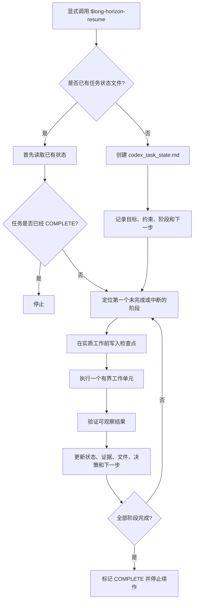

# Long Horizon Resume

[English README](README.md)

一个面向长时间 Codex 任务的**断点续作 Skill**。它适用于可能跨越 usage/reset window、应用重启或延迟续跑的任务，通过持久化检查点让后续执行从已有进度继续，而不是重新开始。

`long-horizon-resume` 的核心不是“让任务无限运行”，而是把大型任务改造成**可持久化、可验证、可幂等恢复**的工作流。它将任务状态写入项目目录中的状态文件，并把该文件作为恢复时的权威记录，而不是依赖对话上下文本身。

> **重要说明：**该 Skill **不会绕过、延长或修改任何使用额度或配额限制**。它只负责保存足够的持久化状态，使执行条件恢复后可以安全地继续工作。

## 为什么需要它

长时间 Codex 任务可能因为与任务内容无关的原因中断，例如 usage window 用尽、应用重启、长时间外部计算超过当前模型回合，或者后续续跑时对话上下文已经不完整。

对于这类任务，简单地重新发送原始提示词并不安全。这样可能导致：重复已经完成的工作、覆盖有效结果、重复启动长进程，或者丢失前面已经确定的约束和决策。

本 Skill 通过一个项目本地的持久化状态文件解决这一问题。

## 核心特性

- **仅显式启用**：只有明确调用 `$long-horizon-resume`，或明确要求使用该 Skill 时才会启用。
- **持久化检查点**：目标、约束、阶段状态、输出、验证证据、失败信息和下一步动作都会写入磁盘。
- **幂等续作**：已经完成且验证通过的工作会被复用，而不是重新生成。
- **有界工作单元**：大型任务被拆分为具有明确完成判据的阶段。
- **长进程状态记录**：可记录外部任务的 PID/job ID、日志、预期输出以及安全恢复方式。
- **避免重复进程**：恢复时先检查已有任务是否仍然存活，再决定是否需要重新启动。
- **完成前必须验证**：当产物本身可以检查时，不会只根据命令返回码判断成功。
- **可选自动续作**：如果当前运行环境提供合适的计划任务/续作能力，最多创建一个 continuation automation；否则退化为手动续作模式。

## 工作流程



持久化状态文件是恢复时的权威信息源。对话上下文可以辅助理解，但不被视为可靠的断点记录。

## 仓库结构

```text
long-horizon-resume/
├── SKILL.md
├── agents/
│   └── openai.yaml
├── references/
│   └── state-template.md
├── README.md
└── README.zh-CN.md
```

| 路径 | 作用 |
| --- | --- |
| `SKILL.md` | Skill 主工作流，包括启用边界、检查点协议、恢复规则和完成判据。 |
| `agents/openai.yaml` | OpenAI 侧的显示元数据和“禁止隐式调用”策略。 |
| `references/state-template.md` | 用于创建持久化 Codex 任务状态文件的模板。 |

## 安装

该仓库按照以 `SKILL.md` 为核心的 Agent Skill 形式组织。请通过你所使用的 Codex/OpenAI 环境所提供的 Skill 安装或导入机制，安装 `long-horizon-resume/` 目录。

OpenAI 对 Skill 的定义是：以 `SKILL.md` 为核心、可附带模板和其他资源的可复用工作流。具体安装方式和可用范围可能因产品与运行界面不同而变化，因此应以你当前产品提供的安装入口为准。

官方背景资料：[OpenAI — Using skills](https://openai.com/academy/skills/)

## 使用方法

将 Skill 与实际任务一起显式调用。例如：

```text
$long-horizon-resume 重构这个项目，运行完整测试，修复回归问题，
并生成最终经过验证的构建结果。如果跨越 usage window，请保留已有进度并从检查点继续。
```

也可以使用自然语言明确指定：

```text
这个任务使用 $long-horizon-resume。
如果执行被中断，不要从头开始，而是读取持久化状态并从已有检查点继续，直到所有阶段验证完成。
```

Skill 通常会在项目中创建：

```text
codex_task_state.md
```

如果该文件已经属于另一个任务，则会使用任务专属状态文件，避免覆盖无关任务的恢复信息。

## 持久化状态文件

状态文件保存恢复任务所需的关键字段，例如：

```text
SKILL: long-horizon-resume
TASK_ID: <stable id>
OVERALL_STATUS: ACTIVE
CONTINUATION_MODE: <automation|manual>
PROJECT_ROOT: <path>
CURRENT_STAGE: <stage id>
NEXT_ACTION: <one exact next action>
```

同时还会记录：

- 用户原始目标；
- 不可破坏的约束和工具路线；
- 各阶段状态与完成证据；
- 已创建或修改的文件与产物；
- 正在运行的外部进程；
- 重要决策与映射关系；
- 验证记录；
- 阻塞项和失败证据；
- 精确的恢复指令；
- 任务完成后的摘要。

完整结构见 [`references/state-template.md`](references/state-template.md)。

## 恢复语义

每次续作时，Skill 都会先读取状态文件，再决定是否执行新工作。

| 已记录状态 | 恢复行为 |
| --- | --- |
| `DONE` 且已验证 | 直接复用，不重新生成。 |
| `IN_PROGRESS` 且预期输出已存在 | 先检查和验证，再决定是否重跑。 |
| `IN_PROGRESS` 且外部长进程仍存活 | 不启动重复任务。 |
| `FAILED` | 先读取记录的失败证据，再决定是否重试。 |
| 项目被外部修改 | 先识别冲突，不静默覆盖更新后的文件。 |
| `OVERALL_STATUS: COMPLETE` | 停止执行，除非用户明确开启新任务。 |

这一规则是避免昂贵的“从头重做”和重复后台任务的关键。

## 外部长时间运行任务

在启动可能超过当前模型回合的计算、转换、构建或其他外部进程前，工作流会尽量持久化以下信息：

- 命令或任务描述；
- 工作目录；
- PID 或 job ID（若可获得）；
- stdout/stderr 或日志路径；
- 预期输出路径；
- 启动时间；
- 如何判断进程是否仍在运行；
- 如何验证最终成功；
- 失败后重新启动是否安全。

后续续作会先检查已有进程和输出，而不是因为前一个模型回合已经结束就直接再次启动同一个任务。

## 自动续作

如果当前 Codex 运行界面暴露了合适的计划任务或 continuation 能力，该 Skill 可以为当前任务使用**最多一个**续作 automation。它的作用只是重新进入同一套持久化工作流，而不是重新定义任务。

如果当前环境没有这种能力，则记录：

```text
CONTINUATION_MODE: manual
```

并在状态文件中保存精确的人工恢复指令。运行环境不支持自动续作时，本 Skill 不会声称自己能够后台自动继续。

## 设计原则

该工作流有意采用较保守的恢复策略：

1. **昂贵操作前先保存状态。** 配额中断可能突然发生，不能依赖“最后再保存一次”。
2. **每个阶段必须有可观察的完成判据。** 避免仅凭模型主观判断“已经做完”。
3. **验证产物，而不仅是命令。** 返回码为 0 并不能证明文档、构建、数据集或数值结果本身正确。
4. **优先复用，而不是重新生成。** 即使总任务尚未完成，已经验证的中间结果仍然应保留。
5. **让下一步具有确定性。** `NEXT_ACTION` 应尽量只描述一个明确的下一动作。
6. **避免重叠 worker。** 同一个任务不应不断创建新的后台任务或重复续作实例。

## 它不做什么

- 不增加或绕过 Codex/ChatGPT 使用额度。
- 不保证操作系统级进程在应用重启或机器重启后仍然存活。
- 当前运行环境没有调度能力时，不会凭空创建调度能力。
- 不会因为任务“看起来很长”就自动启用。
- 不替代项目自己的测试、数值验证、渲染检查或其他专业验证流程。

## 适用场景

当任务持续时间长、重新执行成本高，并且中间结果可以独立验证时，这个 Skill 最有价值。例如：

- 大型代码库分阶段重构与测试；
- 文档/PPT 重建以及多轮渲染验证；
- 长时间数值模拟或格式转换；
- 多阶段数据处理流水线；
- 包含大量独立可验证步骤的仓库迁移；
- 需要跨续作保留中间产物的科研和工程计算任务。

对于可以在一次会话中稳定完成的普通任务，使用该 Skill 反而会增加不必要的状态管理开销。

## 贡献

欢迎提交 Issue 和 Pull Request。修改应尽量保持以下核心保证不变：**显式启用、持久化状态、幂等恢复、避免重复进程、完成前验证**。

如果修改了状态文件结构，请同步更新 `SKILL.md` 和 `references/state-template.md`，避免工作流定义与恢复记录不一致。
